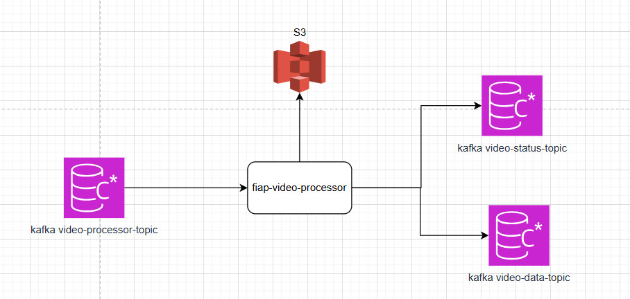

# 🎬 FIAP Video Processor

Aplicação responsável por consumir o tópico `video-processor`, processar vídeos, criar arquivos ZIP e realizar o upload novamente no **S3**.

Após o processamento, a aplicação:

- Envia uma mensagem no tópico `video-status` para atualizar o status do vídeo e notificar o usuário caso o vídeo tenha sido processado com sucesso ou ocorrido algum erro;
- Publica uma mensagem no tópico `video-data` para atualizar a URL do vídeo no **S3**.

---

## 📸 Funcionamento

Fluxo geral:

1. Consome mensagens do tópico `video-processor`.
2. Processa o vídeo e cria o arquivo ZIP.
3. Realiza o upload do vídeo processado no S3.
4. Publica mensagens nos tópicos Kafka (`video-status` e `video-data`) para que outras aplicações atualizem informações e notifiquem usuários.

---

## ⚙️ Tecnologias Utilizadas

- **Java 21**
- **Spring Boot**
- **Kafka**
- **Docker** (opcional)
- **S3** (armazenamento de vídeos)
